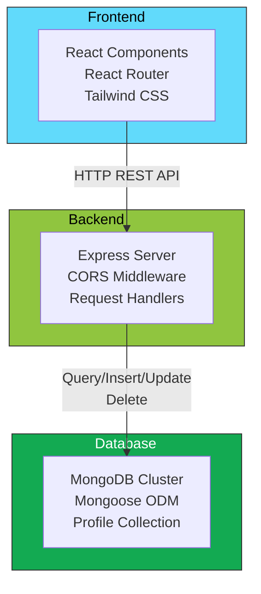
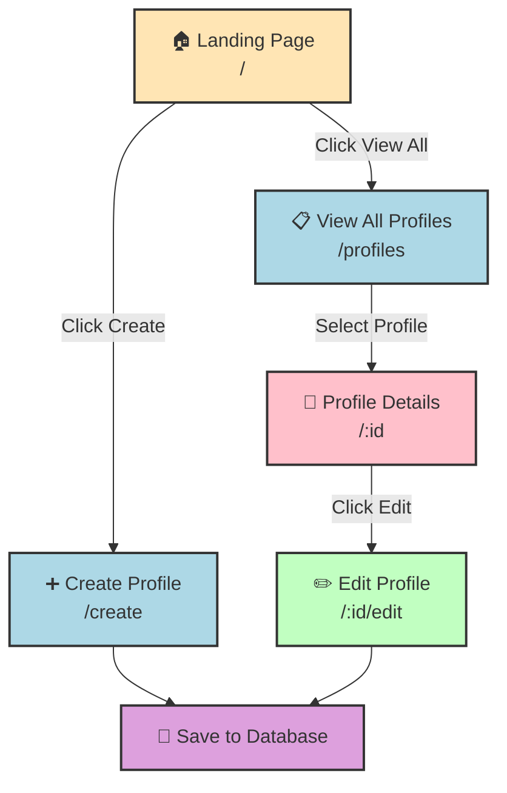
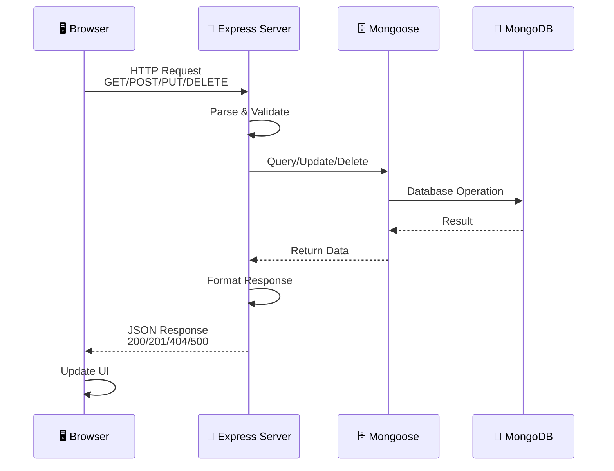
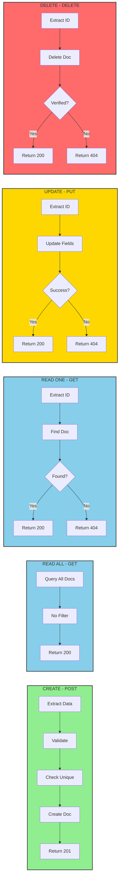
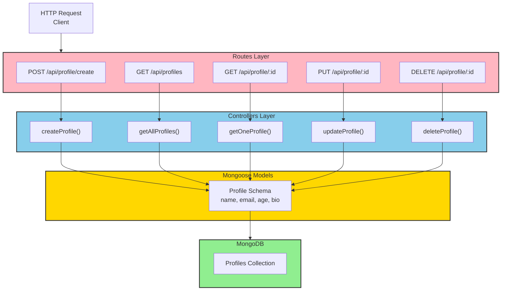
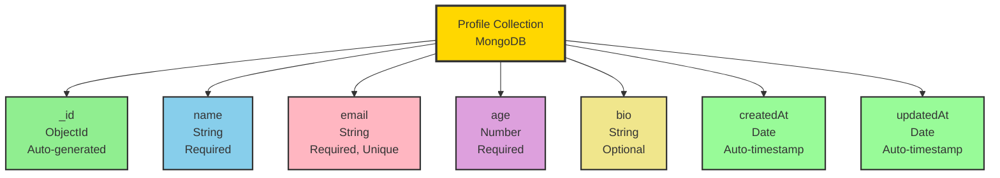
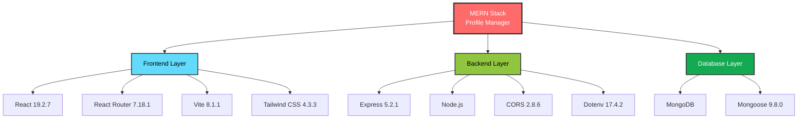
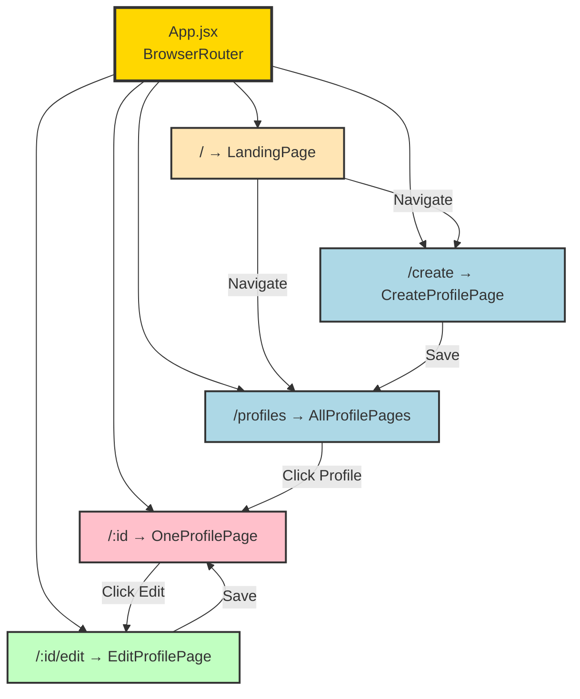
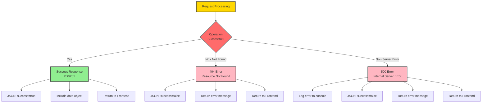
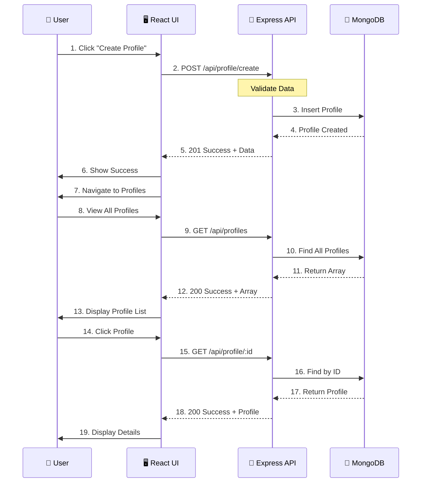

# Profile Management System - Visual Diagrams Guide

## 🎨 Mermaid Diagram Code

Here are the diagrams converted to **Mermaid format** that you can use directly:

### **1. System Architecture Diagram**

---

### **2. Frontend User Flow Diagram**

---

### **3. API Request/Response Flow**

---

### **4. CRUD Operations Flow**

---

### **5. Backend Architecture**

---

### **6. Database Schema**

---

### **7. Technology Stack**

---

### **8. Route Structure**

---

### **9. Error Handling Flow**

---

### **10. Complete Data Flow Lifecycle**

